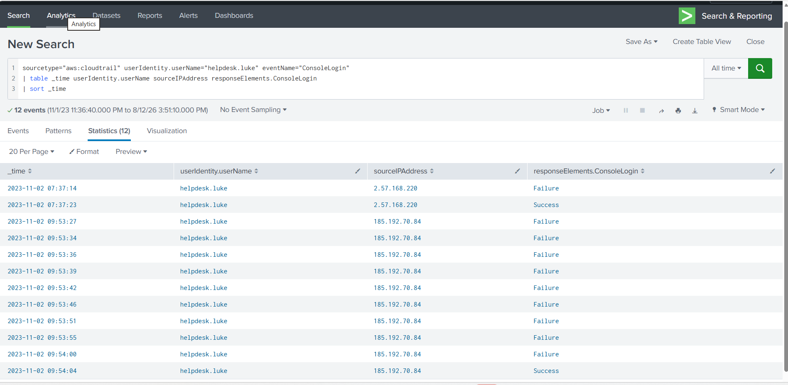
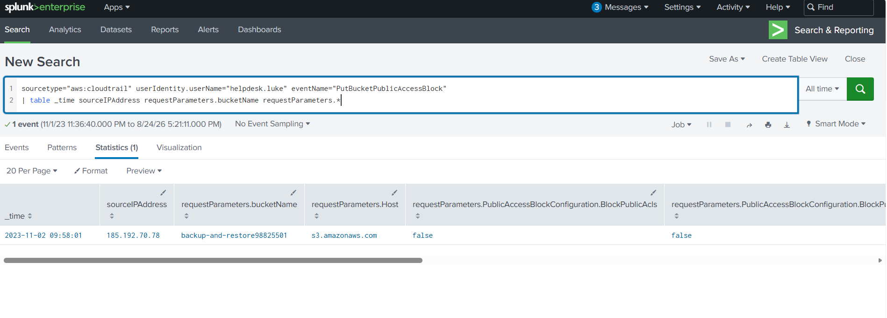
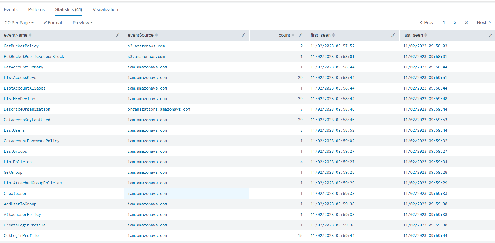
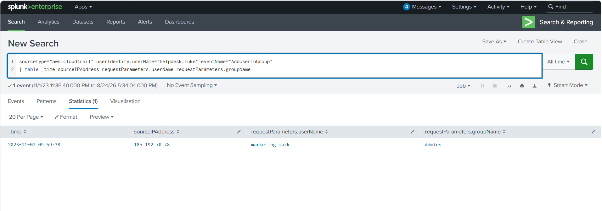

# AWSRaid – AWS CloudTrail Investigation with Splunk

## Overview

This project documents a hands-on cloud security investigation performed using Splunk to analyze AWS CloudTrail logs from the CyberDefenders AWSRaid lab.

The investigation focused on identifying a compromised AWS IAM account and tracing the attacker's activity after gaining access to the environment. Rather than relying only on the lab questions, I analyzed authentication activity, source IP addresses, S3 access, IAM account changes, and security configuration changes to reconstruct the attack.

## Tools and Technologies

- Splunk Enterprise
- Splunk Search Processing Language (SPL)
- AWS CloudTrail
- AWS IAM
- Amazon S3
- Log Analysis
- Incident Investigation

## Investigation Summary

Analysis of the CloudTrail logs identified suspicious activity involving the IAM account `helpdesk.luke`.

The account experienced multiple failed authentication attempts from the external IP address `185.192.70.84`, followed by a successful login. Activity following the successful authentication showed access to multiple S3 resources and changes to AWS security configurations.

Further investigation identified the creation of a new IAM user, `marketing.mark`, which was subsequently added to the `Admins` group, indicating an attempt to establish privileged persistence within the AWS environment.

## Initial Access Investigation

The first stage of the investigation focused on AWS console authentication activity. I analyzed `ConsoleLogin` events in CloudTrail and compared usernames, source IP addresses, and authentication results.

The account `helpdesk.luke` showed a particularly suspicious authentication pattern. At 09:53:27 on November 2, 2023, repeated failed login attempts began from the external IP address `185.192.70.84`.

Nine consecutive authentication attempts failed before a successful login occurred at 09:54:04 from the same IP address.

### Key Evidence

- Compromised account: `helpdesk.luke`
- Suspicious source IP: `185.192.70.84`
- Failed login attempts: 9
- Successful login: `2023-11-02 09:54:04`
- AWS event: `ConsoleLogin`

This failure-to-success pattern, combined with the subsequent AWS activity performed through the account, indicated that the credentials for `helpdesk.luke` had been compromised.

### Splunk Evidence

## S3 Data Access Investigation

After identifying `helpdesk.luke` as the compromised account, I investigated the account's Amazon S3 activity to determine what data was accessed after the compromise.

CloudTrail `GetObject` events revealed that `helpdesk.luke` accessed eight objects across multiple S3 buckets between 09:55:53 and 09:57:11 on November 2, 2023.

| S3 Bucket | Object |
|---|---|
| `research-project-files23411723` | `prototype.obj` |
| `product-designs-repository31183937` | `Product2_CAD_Designs.dwg` |
| `marketing-assets-vault27512203` | `logo.png` |
| `legal-docs45020393` | `Contract_Agreement.pdf` |
| `customer-data-backup57893984` | `CustomerData_Backup_2023-11-01.zip` |
| `contracts-data67988444` | `Contract_Termination_Letter_Client.pdf` |
| `backup-and-restore98825501` | `Configuration_Backup_Server2.zip` |
| `backup-and-restore98825501` | `secrets_vault_dump.bak` |

### Analysis

The accessed data included product designs, customer backups, legal documents, server configuration data, and a secrets vault dump.

Of particular interest was `Product2_CAD_Designs.dwg` in the `product-designs-repository31183937` bucket. A DWG file is commonly associated with CAD design data, making this potentially sensitive intellectual property.

The suspicious login succeeded at 09:54:04, and the first observed S3 object access occurred at 09:55:53, less than two minutes later. This timing strengthens the correlation between the account compromise and the subsequent S3 activity.

## S3 Public Access Configuration Change

The investigation then identified a security configuration change affecting the S3 bucket `backup-and-restore98825501`.

At `2023-11-02 09:58:01`, the compromised `helpdesk.luke` account issued a `PutBucketPublicAccessBlock` operation from source IP address `185.192.70.78`.

The CloudTrail event showed public access block settings being set to `false`, weakening the bucket's protection against public access.

### Key Evidence

- AWS event: `PutBucketPublicAccessBlock`
- S3 bucket: `backup-and-restore98825501`
- Timestamp: `2023-11-02 09:58:01`
- Source IP: `185.192.70.78`
- Public access protection setting: `false`

### Analysis

This activity is significant because changing an S3 bucket's public access controls can expose data that was previously protected. In the context of the compromised account and the preceding S3 object access, this represents a potentially dangerous cloud security configuration change.

### Splunk Evidence

## IAM Persistence and Privilege Escalation

Following the S3 activity, the investigation showed that the compromised `helpdesk.luke` account began making changes to AWS IAM.

At `2023-11-02 09:59:33`, a `CreateUser` event created a new IAM account named `marketing.mark`.

Only five seconds later, at `09:59:38`, an `AddUserToGroup` event added `marketing.mark` to the `Admins` group.

### Key Evidence

- Compromised account: `helpdesk.luke`
- New IAM user: `marketing.mark`
- User creation event: `CreateUser`
- User creation time: `2023-11-02 09:59:33`
- Group modification event: `AddUserToGroup`
- Group: `Admins`
- Group addition time: `2023-11-02 09:59:38`
- Source IP: `185.192.70.78`

### Analysis

The creation of a new IAM user followed immediately by membership in the `Admins` group is strong evidence of persistence and privilege escalation.

Even if access to the originally compromised `helpdesk.luke` account were later revoked, the attacker could potentially retain privileged access through the newly created `marketing.mark` account.

The sequence also demonstrates why IAM administrative events such as `CreateUser` and `AddUserToGroup` should be closely monitored in AWS environments, particularly when they occur shortly after suspicious authentication activity.

### Splunk Evidence – IAM Activity Timeline

### Splunk Evidence – Privileged Persistence

## Attack Timeline

| Time (2023-11-02) | Activity | Security Significance |
|---|---|---|
| 09:53:27 | Failed `ConsoleLogin` attempts begin against `helpdesk.luke` from `185.192.70.84` | Initial access attempt |
| 09:54:04 | Successful `ConsoleLogin` from `185.192.70.84` | Account compromise |
| 09:55:53 | S3 object access begins | Unauthorized data access |
| 09:56:07 | `Product2_CAD_Designs.dwg` accessed | Potential intellectual property exposure |
| 09:57:11 | `secrets_vault_dump.bak` accessed | Potential credential/secret exposure |
| 09:58:01 | `PutBucketPublicAccessBlock` executed against `backup-and-restore98825501` | S3 security control weakened |
| 09:59:33 | `marketing.mark` created | Persistence established |
| 09:59:38 | `marketing.mark` added to `Admins` | Privileged persistence / privilege escalation |

## Incident Conclusion

The CloudTrail evidence shows a clear sequence of malicious activity beginning with the compromise of `helpdesk.luke`.

After successfully authenticating, the attacker rapidly accessed sensitive S3 objects, modified an S3 public-access security control, created a new IAM user, and granted that user administrative group membership.

The investigation demonstrates how authentication, S3, and IAM telemetry can be correlated in Splunk to reconstruct an AWS account compromise and identify the attacker's progression through the cloud environment.

## Detection and Defensive Recommendations

Based on the investigation, several detection opportunities could help identify or prevent similar AWS account compromises.

### Recommended Detections

- Alert on repeated failed `ConsoleLogin` events followed by a successful login from the same source IP.
- Monitor successful AWS console logins from unusual or previously unseen IP addresses.
- Alert on high-volume or unusual S3 `GetObject` activity involving sensitive buckets.
- Monitor changes to S3 public access controls, particularly `PutBucketPublicAccessBlock` events that weaken existing protections.
- Alert whenever new IAM users are created unexpectedly.
- Monitor `AddUserToGroup` events involving privileged groups such as `Admins`.
- Correlate suspicious authentication activity with subsequent S3 and IAM administrative actions.

## Skills Demonstrated

- AWS CloudTrail log analysis
- Splunk SPL investigation
- Authentication analysis
- AWS IAM security monitoring
- Amazon S3 security analysis
- Incident timeline reconstruction
- Indicator correlation
- Cloud account compromise investigation
- Detection engineering fundamentals
