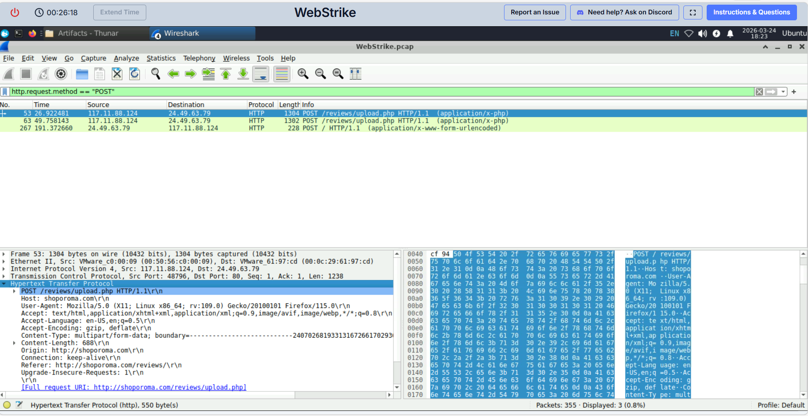
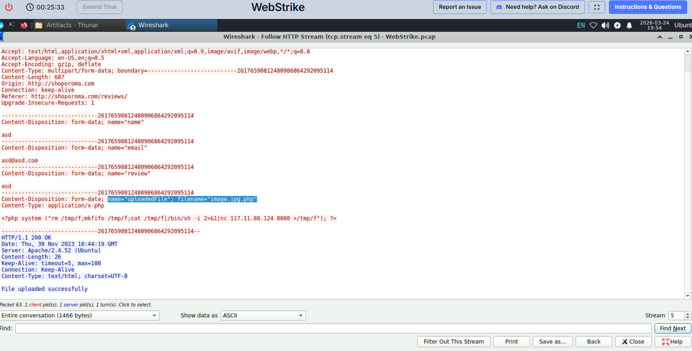

# Web Traffic Analysis – Malicious File Upload Investigation

**Role:** SOC Analyst (Simulated Investigation)

---

## Objective
## Objective
The objective of this investigation was to analyze a PCAP file, identify the source of suspicious web activity, determine how the attack was carried out, and document key indicators of compromise.

---

## Scenario Summary
## Scenario Summary
A packet capture file was provided for analysis. The goal was to investigate suspicious HTTP activity, identify the attacker, determine the origin of the traffic, and examine whether a malicious file was uploaded to the target server.

---

## Tools Used
- Wireshark  
- CyberDefenders Platform  
- IP Geolocation (ipinfo.io)

---

## Investigation steps

### 1. Initial Traffic Review
The PCAP file was opened in Wireshark to review the overall traffic and identify the main communicating hosts.

---

### 2. Identifying Communicating Hosts
Using **Statistics → Conversations → IPv4**, I identified two main IP addresses involved in the communication:

- **117.11.88.124**
- **24.49.63.79**

The conversation statistics showed repeated communication between these two hosts, with **117.11.88.124** sending slightly more packets. This suggested that **117.11.88.124** was likely the initiator of the activity.

---

### 3. Analyzing HTTP Traffic
To focus on web activity, I applied the following filter:
`http.request.method == "GET"`
This revealed multiple HTTP GET requests originating from **117.11.88.124** to **24.49.63.79**.

The requests included paths such as:
- `/`
- `/products`
- `/reviews`
- `/admin`
- `/uploads`

This pattern suggests possible **directory enumeration or probing activity**, which is commonly associated with reconnaissance attempts.

---

### 4. Identifying the Attacker
Since HTTP requests are initiated by the client, the source IP of the GET requests (**117.11.88.124**) was identified as the likely attacker.

---

### 5. Geolocation Analysis
The IP address **117.11.88.124** was analyzed using an external IP geolocation service.

The results showed that the traffic originated from:

- **City:** Tianjin  
- **Country:** China

### 6. Identifying the User-Agent
To further investigate the activity, HTTP request headers were analyzed in Wireshark.

A POST request to `/reviews/upload.php` was examined, which indicated a file upload attempt. By expanding the Hypertext Transfer Protocol section, the User-Agent string used by the attacker was identified.

The User-Agent was:
`Mozilla/5.0 (X11; Linux x86_64; rv:109.0) Gecko/20100101 Firefox/115.0`

This suggests the attacker was using a Linux-based system with Firefox, which can help in detecting and filtering similar malicious activity. 

### 7. Identifying the Uploaded Web Shell

HTTP POST requests to `/reviews/upload.php` were analyzed to determine how the suspicious file was introduced.

Two upload attempts were identified. The first attempt used the filename `image.php`, but the server response returned "Invalid file format", indicating that the upload failed.

A second upload attempt used the filename:

`image.jpg.php`

By following the HTTP stream, the server response returned "File uploaded successfully", confirming that this file was successfully uploaded.

The file content revealed a PHP reverse shell payload, indicating that the attacker successfully deployed a malicious web shell on the server.
---

### 8. Identifying the Upload Directory

To determine where the uploaded file was stored, I searched for HTTP requests referencing the uploaded web shell.

Filter used:
http.request.uri contains "image.jpg.php"

This revealed the following request:

GET /reviews/uploads/image.jpg.php HTTP/1.1

This indicates that the uploaded file was stored and executed from the following directory:

/reviews/uploads/

This confirms the location of the uploaded web shell on the server.

## Findings

- **Attacker IP Address:** 117.11.88.124  
- **Victim IP Address:** 24.49.63.79  
- **Protocol:** HTTP  
- **Observed Activity:** Multiple HTTP GET requests  
- **Attack Behavior:** Web probing / directory enumeration  
- **Geographical Origin:** Tianjin, China
- **User-Agent:** Mozilla/5.0 (X11; Linux x86_64; rv:109.0) Gecko/20100101 Firefox/115.0
- **Malicious File:** image.jpg.php
---

## Indicators of Compromise (IOCs)

- 117.11.88.124 (Suspicious external IP)

---

## Conclusion
Based on the analysis of network traffic and HTTP request patterns, the attack was determined to originate from the IP address 117.11.88.124. Geolocation of this IP indicates that the source of the activity was Tianjin, China. The observed behavior suggests reconnaissance activity targeting web application endpoints.

---

## Recommendations
- Block the identified IP address at the firewall level  
- Monitor for similar HTTP probing behavior  
- Restrict access to sensitive endpoints such as `/admin`  
- Implement web application security controls (e.g., WAF)  

---

## Evidence

### Figure 1: IPv4 Conversations

### Figure 2: HTTP GET Requests

### Figure 3: User-Agent Identification

### Figure 4: Malicious File Upload (HTTP Stream)

