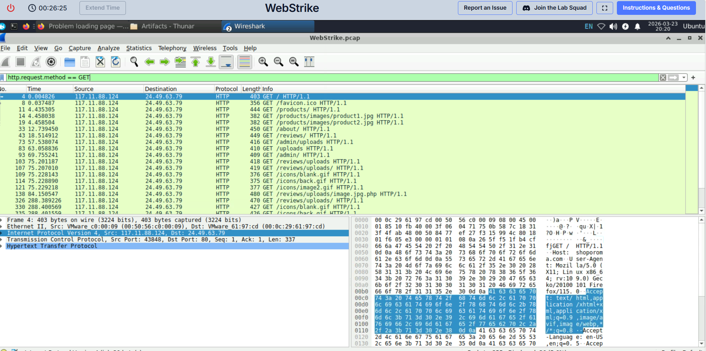
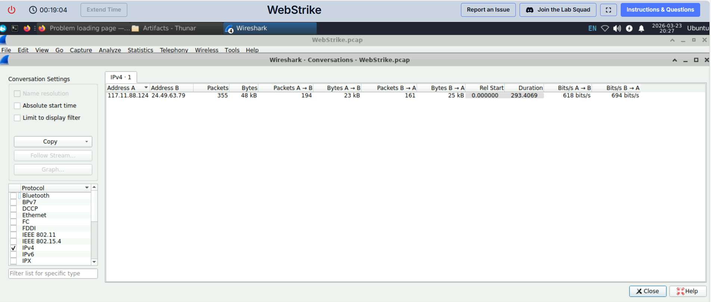

# Web Traffic Analysis – Identifying Attack Source (CyberDefenders)

**Role:** SOC Analyst (Simulated Investigation)

---

## Objective
The objective of this investigation was to analyze network traffic from a PCAP file and identify the source of suspicious activity, including determining the geographical origin of the attack.

---

## Scenario Summary
A packet capture file was provided for analysis. The goal was to examine the traffic, identify any suspicious communication, and determine where the attack originated from.

---

## Tools Used
- Wireshark  
- CyberDefenders Platform  
- IP Geolocation (ipinfo.io)

---

## Investigation Process

### 1. Initial Traffic Review
The PCAP file was loaded into Wireshark to begin analysis of network activity.

---

### 2. Identifying Communicating Hosts
Using **Statistics → Conversations → IPv4**, I identified two primary IP addresses involved in the communication:

- 117.11.88.124  
- 24.49.63.79  

From the packet statistics, both IPs showed active communication, with 117.11.88.124 sending slightly more packets.

---

### 3. Analyzing HTTP Traffic
To focus on web activity, I applied the following filter:

This revealed multiple HTTP GET requests originating from **117.11.88.124** to **24.49.63.79**.

The requests included paths such as:
- `/`
- `/products`
- `/reviews`
- `/admin`
- `/uploads`

This pattern suggests possible **directory enumeration or probing activity**, which is commonly associated with reconnaissance attempts.

---

### 4. Identifying the Attacker
Since HTTP requests are initiated by the client, the source IP of the GET requests (**117.11.88.124**) was identified as the likely attacker.

---

### 5. Geolocation Analysis
The IP address **117.11.88.124** was analyzed using an external IP geolocation service.

The results showed that the traffic originated from:

- **City:** Tianjin  
- **Country:** China  

---

## Findings

- **Attacker IP Address:** 117.11.88.124  
- **Victim IP Address:** 24.49.63.79  
- **Protocol:** HTTP  
- **Observed Activity:** Multiple HTTP GET requests  
- **Attack Behavior:** Web probing / directory enumeration  
- **Geographical Origin:** Tianjin, China  

---

## Indicators of Compromise (IOCs)

- 117.11.88.124 (Suspicious external IP)

---

## Conclusion
Based on the analysis of network traffic and HTTP request patterns, the attack was determined to originate from the IP address 117.11.88.124. Geolocation of this IP indicates that the source of the activity was Tianjin, China. The observed behavior suggests reconnaissance activity targeting web application endpoints.

---

## Recommendations
- Block the identified IP address at the firewall level  
- Monitor for similar HTTP probing behavior  
- Restrict access to sensitive endpoints such as `/admin`  
- Implement web application security controls (e.g., WAF)  

---

## Evidence

### Figure 1: IPv4 Conversations

### Figure 2: HTTP GET Requests

### Figure 2: HTTP GET Requests

### Figure 3: IP Geolocation Result

